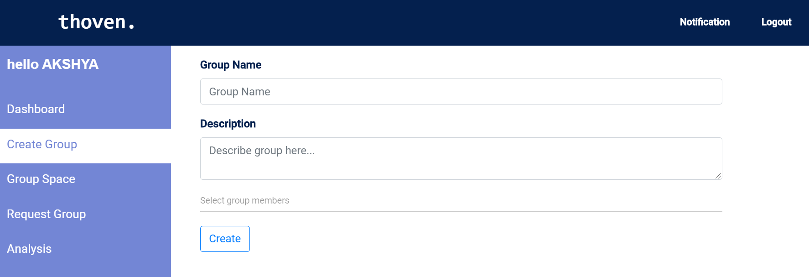
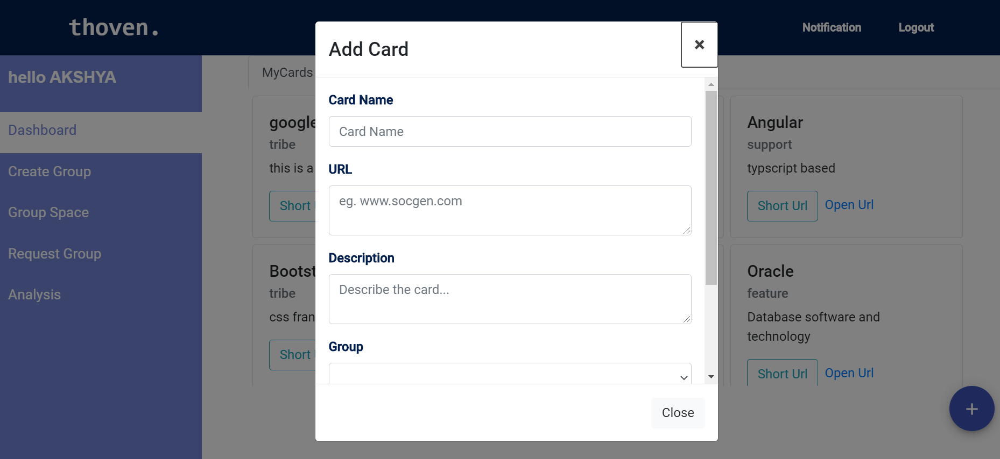
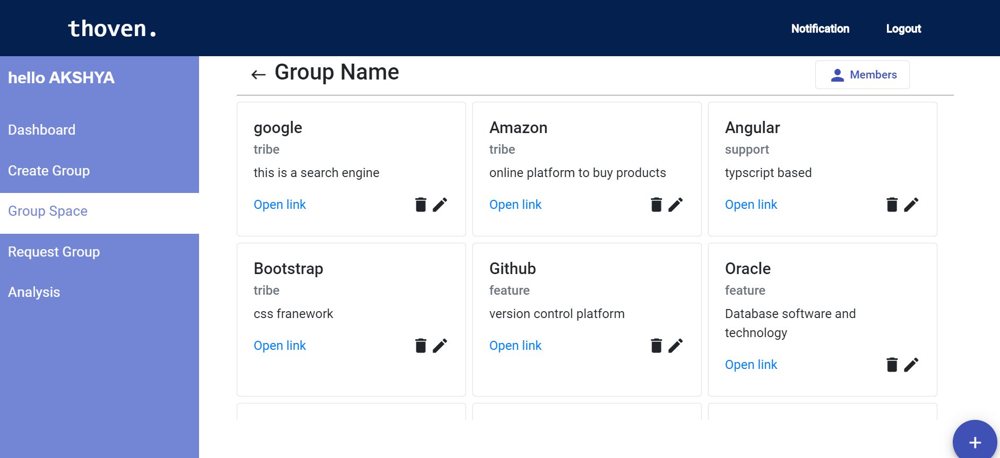
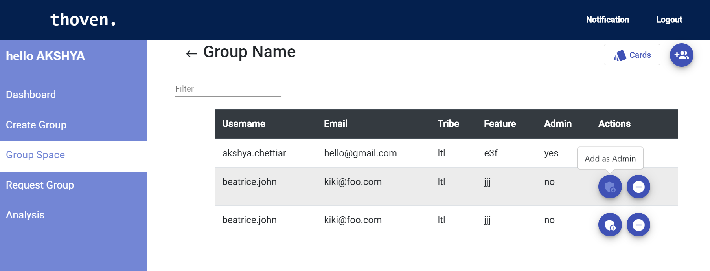
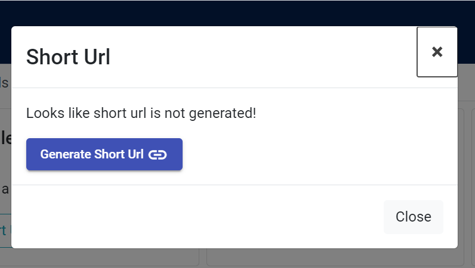
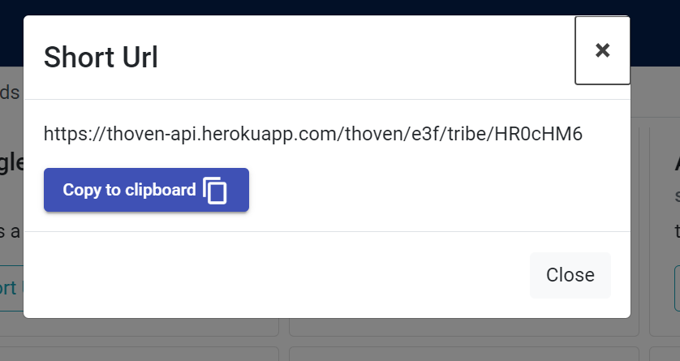

# ENGINEERING STREAM HACKATHON - THOVEN

> Thoven is a web application that allows users to save bookmarks
> represented by cards. Each card has a short title, brief description and 
> user can generate short url which can shared with other users. 
> In case you are wondering why the name Thoven? Thoven name is inspired by Thoven Stevens
> who first introduced us with his Book Markers(Bookmarks).

## Technology Stack

### Backend
>  *  Language: Java - JDK-11
>  *  Framework: Spring boot, Spring security and Spring Data JPA

### Frontend
>  *  Language: Typescript
>  *  Frontend: Angular (CLI v10)

### Database
>  *  MySQL

## Functional Operations

*  A user's account is created including details of tribe and feature team name.

* The user can create a group and add members to the particular group, by default the user creating group
  will be admin. Now the user can add cards by providing title, url and brief description.
  

   

     

* Any user who have an account in Thoven can create a group. If a user is added to a group and not assigned as
  admin, he/she cannot create a card for that particular group.
  
* A dashboard is provide to user, where they can check the details of all the cards which they have access, in other words,
  the page will show all the cards of groups of which the user have access.
  

     

* The admin of the group can add, update and delete cards. They can add, remove or update a user as admin of that group.

     

     

* User can generate a short url for the card and can share the url with other users.

     
     

    
  

