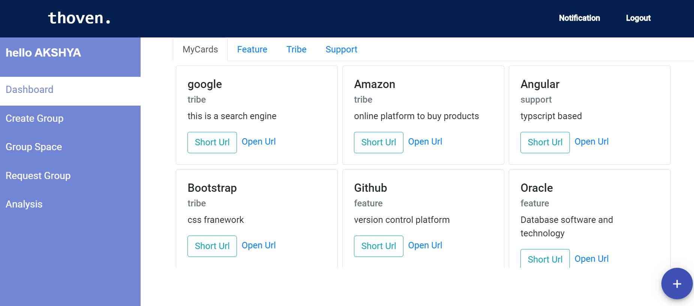
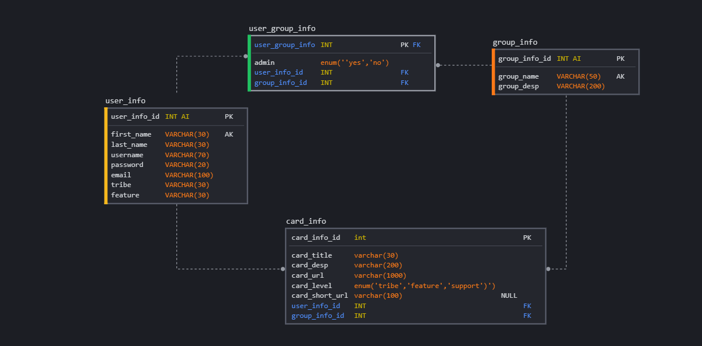

# ENGINEERING STREAM HACKATHON - THOVEN

> Thoven is a web application that allows users to save bookmarks
> represented by cards. Each card has a short title, brief description and 
> user can generate short url which can be shared with other users. 
> In case you are wondering why the name Thoven? Thoven name is inspired by Thomas Stevens
> who first introduced us with his Book Markers(Bookmarks).

## Technology Stack

### Backend
>  *  Language: Java - JDK-11
>  *  Framework: Spring boot, Spring security and Spring Data JPA

### Frontend
>  *  Language: Typescript
>  *  Frontend: Angular (CLI v10)

### Database
>  *  MySQL

## Functional Operations

*  A user's account is created including details of tribe and feature team name.

* The user can create a group and add members to the particular group, by default the user creating group
  will be admin. Now the user can add cards by providing title, url and brief description.
  

   

     

* Any user who have an account in Thoven can create a group. If a user is added to a group and not assigned as
  admin, he/she cannot create a card for that particular group.
  
* A dashboard is provide to user, where they can check the details of all the cards which they have access, in other words,
  the page will show all the cards of groups of which the user have access.
  

     

* The admin of the group can add, update and delete cards. They can add, remove or update a user as admin of that group.

     

     

* User can generate a short url for the card and can share the url with other users.
  The short url includes information of the card's group, level, and a code generated for that card.

     
     

> ## Pictorial representation of DB schema

     

## URL Shortener

> The code for url is generated using the values of the long original url, the unique card number and the length
> of the long original url using BASE64 encoder. From the encoded values random seven consecutive characters are picked and used as 
> code for that card.

## CI/CD

*  travis CI: https://travis-ci.org/github/akshya-engineering-stream-2020
*  Codecov: https://codecov.io/gh/akshya-engineering-stream-2020
*  Codacy: https://app.codacy.com/organizations/gh/akshya-engineering-stream-2020/repositories
## Future Developments

* User can search for groups and request the admin for to add the user (like facebook).
* Bookmark Charts: To show the most used cards and groups used by the particular user as well as the organization level
  (like spotify)
* Notification alerts through emails: when a user sends request to admin, the admin can check the request
  from their emails
* The application uses jwt authentication, so in future the application would be upgraded to authentication using oauth2 client

## Deployment

> Backend and Frontend : Heroku   
> Database : Free MySQL Hosting

## References

* Github: https://github.com/akshya-engineering-stream-2020
* Backend: https://thoven-api.herokuapp.com/swagger-ui.html
* Frontend: https://thoven-ui.herokuapp.com/login

> #### NOTE: For testing one can login to Thoven using username: "akshya.chettiar"
> #### and password: "password".
 

    
  

